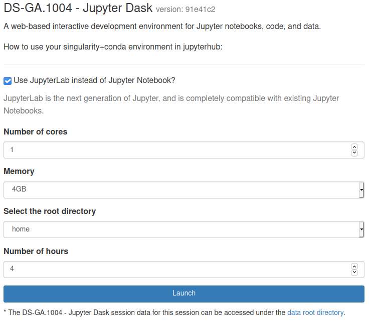

[](https://classroom.github.com/a/vToeXVAJ)
# BIG DATA
## Dask

*Handout date*: 2023-03-22

*results deadline*: 2023-04-07 23:59ET

### Contents:
 - [Part 1. Dask on Greene](#part-1-dask-and-Jupyter-on-greene)
 - [Part 2. Bags and DataFrames](#part-2-bags-and-dataframes)

---


## Part 1. Dask and Jupyter on Greene

We will be using Dask to analyze data on the Greene Cluster.

### Logging into Greene

We will need to clone this project's git repository onto the Greene cluster.

Logging into Greene works differently from Dataproc.  Please consult the [HPC documentation](https://sites.google.com/a/nyu.edu/nyu-hpc/documentation/hpc-access).

Once we are logged into the Greene cluster, clone this repository using the git command-line:

```bash
git clone <weR PROJECT REPOSITORY URL>
```

### Launching Jupyter on Greene

The Greene cluster allows us to run Jupyter-lab directly on the compute nodes.
Doing this requires that we're either on the NYU network, or connected via the
[virtual private network
(VPN)](https://www.nyu.edu/life/information-technology/getting-started/network-and-connectivity/vpn.html).

Once we are on the NYU network, go to https://ood.hpc.nyu.edu and login with wer
NYU credentials.

At the top of the page, we will see a menu titled *Interactive Apps▾*, and within
that menu, an entry for **DS-GA.1004 - Jupyter Dask**.


Following this link will take we to a screen to start the dask-enabled Jupyter-lab
server.  We should not need more than 1 core -- this refers to
the number of cores used by the notebook, not the distributed computation executed
by dask -- and 4GB of main memory.  When we have configured wer session, click the
**Launch** button.



When the Jupyter session is ready, we will see a button **Connect to Jupyter** that
will take us to the active session.


### Running a basic dask computation

In this repository, we will find two notebooks: `Dask starter.ipynb` and `GHCN
analysis.ipynb`.
The first notebook (`Dask starter`) implements some of the examples that we've seen
in class.
Step through this example notebook and make sure that we understand what each piece
is doing before moving on to part 2.

Note that in the starter notebook, all execution is performed by a local dask
client running on the same machine as wer Jupyter session.
In the next section, we'll see how to configure a dask client which uses multiple
compute nodes on the cluster for larger jobs.


## Part 2. Bags and DataFrames

In this part, we will use Dask DataFrames to process a large collection of climate data.

### The Global Historical Climatology Network (GHCN) Data

The [GHCN
dataset](https://www.ncei.noaa.gov/access/metadata/landing-page/bin/iso?id=gov.noaa.ncdc:C00861)
consists of daily summaries of climate data (temperature, precipitation, etc) measured
across the globe.

The full dataset is mirrored on the Greene cluster, and can be located at:

```
/scratch/work/courses/DSGA1004-2021/ghcnd_all/
```

Two smaller versions of the data are also provided, which we can use for
development purposes:

- `/scratch/work/courses/DSGA1004-2021/ghcnd_tiny/`
- `/scratch/work/courses/DSGA1004-2021/ghcnd_small/`


The data consists of around 118,000 files, totalling to about 37 gigabytes.
All files follow a text-based format, described [in the
documentation](https://www1.ncdc.noaa.gov/pub/data/ghcn/daily/readme.txt)
(see section III).

A representative example file looks as follows:
```
ACW00011604194901TMAX  289  X  289  X  283  X  283  X  289  X  289  X  278  X  267  X  272  X  278  X  267  X  278  X  267  X  267  X  278  X  267  X  267  X  272  X  272  X  272  X  278  X  272  X  267  X  267  X  267  X  278  X  272  X  272  X  272  X  272  X  272  X
ACW00011604194901TMIN  217  X  228  X  222  X  233  X  222  X  222  X  228  X  217  X  222  X  183  X  189  X  194  X  161  X  183  X  178  X  222  X  211  X  211  X  194  X  217  X  217  X  217  X  211  X  211  X  200  X  222  X  217  X  211  X  222  X  206  X  217  X
ACW00011604194901PRCP    0  X   30  X    0  X    0  X   25  X   41  X    0  X    0T X    0  X    0  X   56  X    0T X    8  X    0  X    0  X    0  X    0  X    0T X    3  X    0T X   51  X    0  X   53  X    0  X   10  X   15  X   41  X    0T X   86  X   28  X   15  X
...
```
Each row consists of a month's worth of measurements.
The first field encodes the measurement station identifier (in this case,
`ACW00011604`), the year and month (`1949`, `01`), and the quantity being
measured: maximum temperature (`TMAX`), minimum temperature (`TMIN`),
precipitation (`PRCP`), and so on.
The remaining data points consist of measurement numbers (e.g., temperature
in tenths of a degree centigrade), and three measurement flags.

This data format is not a widely used standard (CSV, Parquet, etc), but we provide a function (`load_daily`) to parse these data files into Python dictionaries to get we started.
**Do not modify the `load_daily` function.**
With the example file above, the result of parsing is a list of per-day
observations:
```python
>>> load_daily('ACW00011604.dly')
[{'station_id': 'ACW00011604',
  'year': 1949,
  'month': 1,
  'element': 'TMAX',
  'day': 1,
  'value': 289,
  'measurement': ' ',
  'quality': ' ',
  'source': 'X'},
 {'station_id': 'ACW00011604',
  'year': 1949,
  'month': 1,
  'element': 'TMAX',
  'day': 2,
  'value': 289,
  'measurement': ' ',
  'quality': ' ',
  'source': 'X'},
 {'station_id': 'ACW00011604',
  'year': 1949,
  'month': 1,
  'element': 'TMAX',
  'day': 3,
  'value': 283,
  'measurement': ' ',
  'quality': ' ',
  'source': 'X'},
  ...
```

### Interpreting the data

Each month (row of input data) contains 31 days worth of observations, so
that all rows have the same length (in characters).
**But not all months have 31 days!**
Days with missing observations (e.g., April 31 or February 30) are
represented as having `value = -9999`.
These days should be discarded from any analysis we do.

Additionally, there are three "flag" fields in each observation:
`measurement`, `quality`, and `source`.
- The `measurement` field includes information about how data was collected
(e.g., was it aggregated over 6- or 12-hour periods, whether it was
converted from some other units, etc).
- The `source` field encodes the original source (e.g., various national
  weather agencies) of the measurement data, as GHCN is compiled from multiple other datasets.
- The `quality` field encodes whether this observation failed a data
  validation check.  If `quality` consists of a single blank space (`quality
  == ' '`), the data is presumed "good".

For this project, we should retain only the data that passed previous
quality checks.

### Results

- Our task is to compute for each station, the largest difference between `TMAX` (maximum temperature) and `TMIN` (minimum temperature) recorded within a single
  day.  The output should be a dataframe containing the following fields:
    - `station_id`
    - `t_range` (TMAX - TMIN)

  and contain a single record for each station id, corresponding to the data and value of the maximum observed temperature range for that station.

  Days where either `TMAX` or `TMIN` are not valid should be discarded.

- Repeat this analysis for each version of the data: `ghcnd_tiny`, `ghcnd_small`, and `ghcnd_all`.  
  Save wer results separately for each version, e.g., `tdiff-tiny.parquet`, `tdiff-small.parquet`, `tdiff-all.parquet`.
  **Remember to commit these results to the repository and include them in wer results!**

- In `REPORT.md`, include a brief summary description of wer solution (1--2 paragraphs).  Answer the following questions:
    - What strategies did we use to optimize the computation for the full set?
    - How long does it take to run the computation on tiny, small, and all sets?  Use the `%time` command in jupyterlab to time the final `.compute` 
    - Did we try any alternative implementations that didn't work, or didn't work as well?  If so, how did this change wer approach?
    - Did we encounter any unexpected behavior?
    
- When we have completed the above tasks, be sure to commit all results and the report document to git, and push the results back up to GitHub to submit wer project.


## General tips

- Start with a very small subset of input files (say, `ghcnd_tiny/*`) so that we can quickly develop and test wer solution.
- Start with a local Dask client (threaded execution, `LOCAL=True`) before moving to cluster-based execution.
- Before going to the full set, also run on `ghcnd_small/` to verify that wer solution works.
- Get familiar with the [Dask documentation](https://docs.dask.org/en/latest/).
- Try to avoid propagating data that won't be necessary for wer final computation.  Filter wer data as early as we can in the computation graph.
- Experiment with different partitioning strategies to maintain a balanced workload on the cluster.
- Be careful with group-by and reindexing operations - these require a lot of communication.
- When running in cluster mode, we might want to start a terminal through jupyter-lab and monitor the worker outputs.  These will be stored as text files `/scratch/weRNETID/slurm-XXXXXXXX.out`.
- There's more than one way to do this project!  Experiment with different ways of implementing filtering and aggregation.  How fast can we make this run?
